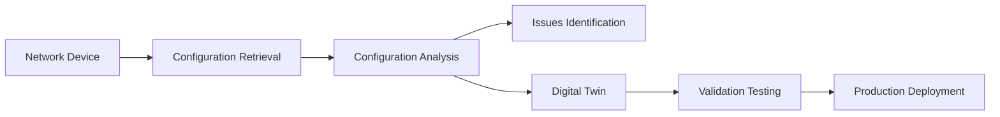

# Spatium Documentation

**Spatium** is a powerful network configuration analyzer and digital twin platform focused on SONiC OS.

## Features

- **Device Configuration Retrieval** - Get configurations via SSH or gNMI
- **Configuration Analysis** - Analyze configurations using Batfish
- **Digital Twin Deployment** - Deploy network digital twins using ContainerLab
- **REST API** - Comprehensive API for integration with other tools

## Project Overview

Spatium helps network engineers and operators analyze, validate, and test network configurations before deploying them to production environments. By combining configuration retrieval, analysis, and digital twin capabilities, Spatium provides a complete workflow for network configuration management.

## Getting Started

Check out the [Installation](getting-started/installation.md) guide to get started with Spatium.