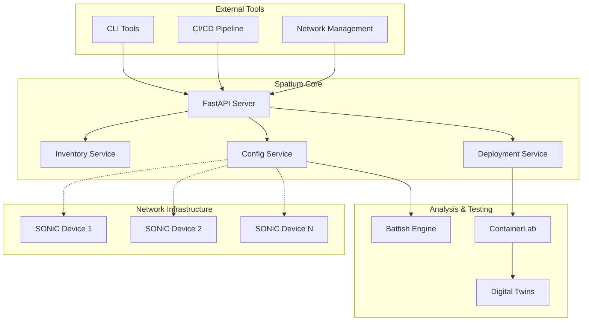

# Welcome to Spatium

**Spatium** is a powerful network configuration analyzer and digital twin platform designed specifically for SONiC-based network infrastructures.

<div class="grid cards" markdown>

-   :material-rocket-launch:{ .lg .middle } **Getting Started**

    ---

    Get up and running with Spatium in minutes

    [:octicons-arrow-right-24: Installation](getting-started/installation.md)
    [:octicons-arrow-right-24: Quick Start](getting-started/quick-start.md)

-   :material-api:{ .lg .middle } **API Usage**

    ---

    Comprehensive API guide with examples

    [:octicons-arrow-right-24: API Usage Guide](usage.md)
    [:octicons-arrow-right-24: API Reference](api/device-api-new.md)

-   :material-book:{ .lg .middle } **User Guide**

    ---

    Learn about Spatium's features and capabilities

    [:octicons-arrow-right-24: Overview](user-guide/overview.md)
    [:octicons-arrow-right-24: Device Configuration](user-guide/device-config.md)

-   :material-code-braces:{ .lg .middle } **Development**

    ---

    Architecture and development resources

    [:octicons-arrow-right-24: Architecture](development/api-architecture.md)
    [:octicons-arrow-right-24: Contributing](development/contributing.md)

</div>

## What is Spatium?

Spatium helps network engineers and operators manage, analyze, and validate network configurations before deploying them to production environments. It provides a unified platform for:

### 🔧 Configuration Management
- **Multi-device inventory management** across different network environments
- **Bulk configuration retrieval** from SONiC devices via SSH
- **Configuration backup and versioning** with automated storage
- **Real-time configuration monitoring** and change detection

### 🌐 Digital Twin Deployment
- **Network topology simulation** using ContainerLab
- **Isolated testing environments** for configuration validation
- **Pre-production testing** to catch issues before deployment
- **Topology version control** and reproducible deployments

### 📊 Network Analysis
- **Traffic reachability analysis** using Batfish engine
- **Configuration validation** and policy compliance checking
- **Network impact assessment** for proposed changes
- **Automated testing workflows** for network reliability

### 🔌 API-First Design
- **RESTful API** for seamless integration with existing tools
- **OpenAPI/Swagger documentation** for easy API exploration
- **Bulk operations** for efficient large-scale management
- **Standardized response formats** for consistent automation

## Architecture Overview



## Key Features

### Device Configuration Management
- **Multi-protocol support**: SSH and gNMI connectivity
- **Inventory organization**: Logical grouping of devices by environment, role, or project
- **Concurrent operations**: Parallel configuration retrieval for efficiency
- **Error handling**: Robust error detection and recovery mechanisms

### Digital Twin Capabilities
- **Topology deployment**: Automated ContainerLab topology creation
- **Configuration testing**: Validate changes in isolated environments
- **Scenario simulation**: Test various network conditions and failure modes
- **Results analysis**: Comprehensive testing reports and recommendations

### Enterprise Integration
- **REST API**: Complete programmatic access to all functionality
- **Authentication**: Secure access control and user management
- **Monitoring**: Built-in logging and metrics for operational visibility
- **Scalability**: Designed for large-scale network environments

## Use Cases

### Network Operations
- **Scheduled backups** of device configurations
- **Change impact analysis** before implementing modifications
- **Compliance monitoring** against organizational policies
- **Incident response** with configuration rollback capabilities

### DevOps & Automation
- **CI/CD integration** for network infrastructure as code
- **Automated testing** of network changes in staging environments
- **Configuration drift detection** and remediation
- **Infrastructure validation** before production deployment

### Network Engineering
- **Design validation** using digital twin environments
- **Capacity planning** with traffic simulation
- **Troubleshooting** with historical configuration analysis
- **Documentation** generation from live network state

## Quick Start Example

Here's a simple example to get you started:

```bash
# 1. Start the Spatium API server
uvicorn spatium.main:app --host 0.0.0.0 --port 8000

# 2. Add a device to your inventory
curl -X POST "http://localhost:8000/topology/inventory/add?inventory=production" \
  -H "Content-Type: application/json" \
  -d '{
    "host": "switch-01.example.com",
    "device_model": "sonic",
    "username": "admin",
    "password": "secure_password"
  }'

# 3. Retrieve and save configurations
curl -X POST "http://localhost:8000/configs/get?inventory=production"
curl -X POST "http://localhost:8000/configs/save?inventory=production"
```

## Next Steps

1. **[Install Spatium](getting-started/installation.md)** - Set up your environment
2. **[Quick Start Guide](getting-started/quick-start.md)** - Get hands-on with basic operations
3. **[API Usage](usage.md)** - Explore comprehensive API examples
4. **[User Guide](user-guide/overview.md)** - Learn about advanced features

Ready to transform your network management workflow? Let's get started! 🚀
- `POST /devices/perle-tty` - Query Perle device TTY ports via REST API (requires Perle REST endpoint at `/api/tty_ports`)

## Getting Started

1. Check out the [Installation](getting-started/installation.md) guide to get started with Spatium
2. Read the [API Usage Guide](usage.md) for comprehensive examples with curl commands
3. See device management scenarios including topology scaling and device removal

## Documentation Server

```
mkdocs serve --dev-addr 0.0.0.0:5000
```
Documentation will be available at [http://localhost:5000](http://localhost:5000) by default.